<!DOCTYPE html>
<html lang="es">
<head>
    <meta charset="UTF-8">
    <meta name="viewport" content="width=device-width, initial-scale=1.0, user-scalable=yes">
    <title>Soledad | Biografía, Patrimonio y Cultura Viva</title>
    <link href="https://fonts.googleapis.com/css2?family=Sora:wght@300;400;600;700;800&family=DM+Sans:wght@300;400;500;600&display=swap" rel="stylesheet">
    <link rel="stylesheet" href="https://cdnjs.cloudflare.com/ajax/libs/font-awesome/6.0.0-beta3/css/all.min.css">
    
</head>
<body>

<header>
    

        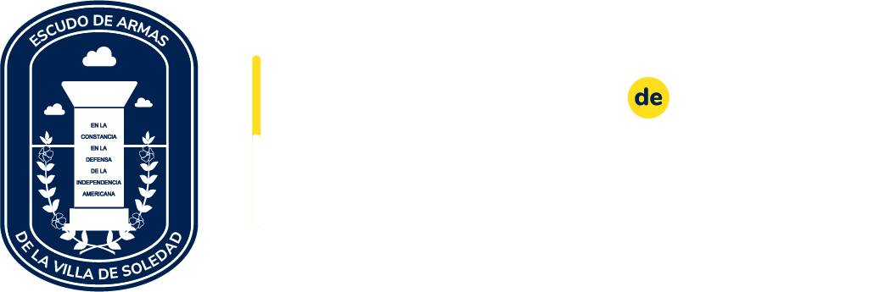
    

    <button class="menu-toggle" id="menuToggle"><i class="fas fa-bars"></i></button>
    <nav id="mainNav">
        <a href="#inicio">Inicio</a>
        <a href="#identidad">Identidad</a>
        <a href="#patrimonio">Patrimonio</a>
        <a href="#gobierno">Gobierno</a>
        <a href="#cultura">Cultura</a>
        <a href="#carnaval">Carnaval</a>
        <a href="#decima">La Décima</a>
        <a href="#entretenimiento">Parque Muvdi</a>
        <a href="#personajes">Personajes</a>
        <a href="#actualidad">Actualidad</a>
        <a href="#naturaleza">Geografía</a>
        <a href="#bolivar">Bolívar</a>
    </nav>
</header>

<!-- Hero -->
<section id="inicio" class="hero-section">
    

        
<i class="fas fa-landmark"></i> NUESTRO MUNICIPIO

        <h1>Soledad, Atlántico Emporio Cultural del Caribe Colombiano</h1>
        
Uno de los municipios más antiguos y poblados de la región Caribe. Cuna del merecumbé, capital mundial de la butifarra, con una herencia histórica colonial y un presente vibrante de cultura, industria y desarrollo urbano.

        

            <i class="fas fa-drumstick-bite"></i> Butifarra
            <i class="fas fa-music"></i> Merecumbé
            <i class="fas fa-church"></i> Patrimonio
        

    

</section>

<!-- Stats Bar -->

    

686k+

Habitantes (2025)

    

1598

Fundación

    

67 km²

Extensión

    

10°54′N

Coordenadas

<!-- Identidad -->
<section id="identidad" class="section">
    

        

            
SÍMBOLOS Y TERRITORIO

            <h2 class="section-title">Identidad de <em>Soledad</em></h2>
        

        

            

                
<i class="fas fa-map-marker-alt"></i>

                <h3>Ubicación</h3>
                
Soledad se ubica en la costa Norte de Colombia, departamento del Atlántico, parte del área metropolitana de Barranquilla. Limita al norte con Barranquilla, al sur con Malambo, al oriente con el río Magdalena y al occidente con Galapa. Altitud: 26 msnm. Clima tropical seco.

                
10°54′N74°46′OGentilicio: Soledeño/a

            

            

                
<i class="fas fa-flag"></i>

                <h3>Bandera</h3>
                
Dos franjas horizontales: superior azul, inferior verde. Representa la riqueza de sus tierras y la conexión con el cielo y la naturaleza.

                

                    
                

            

            

                
<i class="fas fa-shield-alt"></i>

                <h3>Escudo</h3>
                
Resume la lucha independentista. Un pilar central simboliza fuerza, decisión y empuje del pueblo soledeño.

                

                    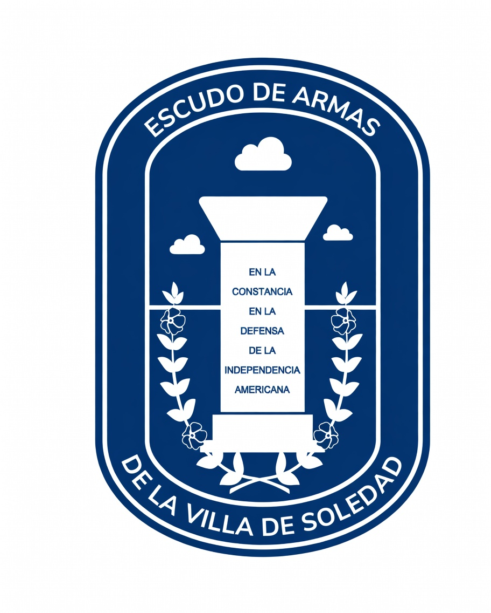
                

            

            

                
<i class="fas fa-music"></i>

                <h3>Himno de Soledad</h3>
                
Letra de José Miguel Orozco y música de Francisco "Pacho" Galán. Celebra la fundación, el paso de Bolívar y el orgullo de Soledad.

                
“Venciendo rudezas de indígena selva...”

                

                    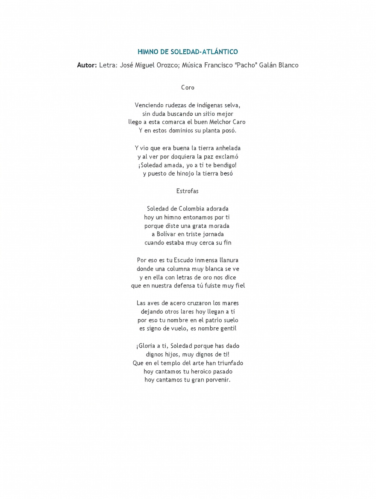
                

                

                    
Himno Oficial de Soledad

                

            

        

        

            <h3>Reseña histórica</h3>
            
En 1598, bajo el capitán Antonio Moreno Estupiñán, se estableció un criadero de cerdos con ocho indígenas, origen de “La Porquera de San Antonio”. En 1640, Melchor Caro tramitó la fundación legal. En 1743 se creó la parroquia y el 20 de enero de 1744 se inauguró oficialmente como parroquia San Antonio de Padua. El 8 de marzo de 1814 se le otorgó el título de villa con el nombre de <strong>Soledad de Colombia</strong>.

            

                
<strong>1598</strong> Fundación del criadero “La Porquera”

                
<strong>1640</strong> Gestión de Melchor Caro

                
<strong>1744</strong> Creación parroquia San Antonio de Padua

                
<strong>1814</strong> Título de Villa “Soledad de Colombia”

            

        

    

</section>

<!-- Patrimonio -->
<section id="patrimonio" class="section">
    

        

            
LEGADO ARQUITECTÓNICO

            <h2 class="section-title">Patrimonio <em>histórico y cultural</em></h2>
        

        

            

                
<i class="fas fa-church"></i>

                <h3>Iglesia San Antonio de Padua</h3>
                
Construida desde 1598, finalizada a finales del siglo XIX. Es el templo más antiguo en pie en el Atlántico. Su altar es barroco churrigueresco, patrimonio del Ministerio de Cultura.

                
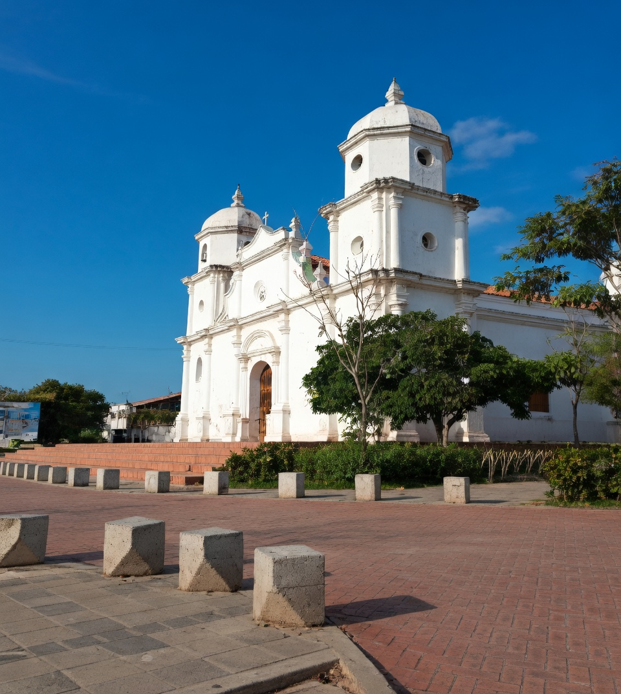

            

            

                
<i class="fas fa-home"></i>

                <h3>Casa Museo Simón Bolívar</h3>
                
Edificación colonial donde el Libertador pernoctó en 1830 antes de su viaje a Santa Marta. Punto clave del patrimonio bolivariano.

                
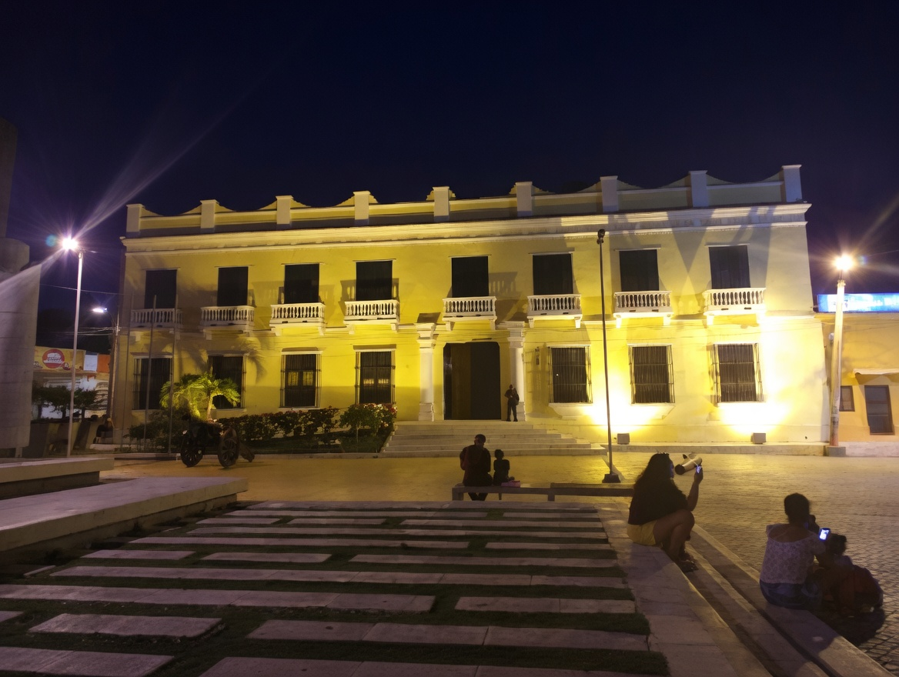

            

            

                
<i class="fas fa-theater-masks"></i>

                <h3>Teatro Olimpia</h3>
                
Construido hacia 1925, estilo republicano. Centro cultural y de entretenimiento de Soledad antes de la televisión. Patrimonio cultural.

                
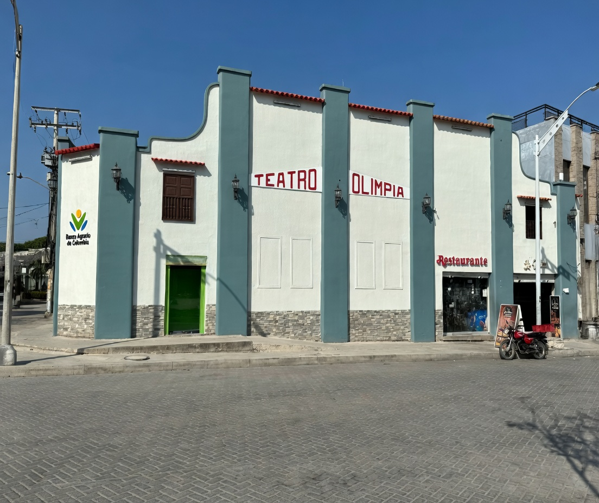

            

            

                
<i class="fas fa-tree"></i>

                <h3>Plaza Mayor de Soledad</h3>
                
Remodelada en 2022, corazón religioso y cultural. Rodea la iglesia y la Casa Museo. Punto de encuentro gastronómico y turístico.

                
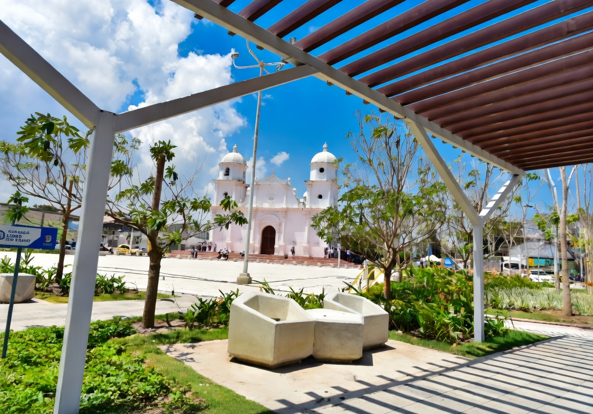

            

        

    

</section>

<!-- Gobierno (Alcaldesa, datos, clima, barrios) -->
<section id="gobierno" class="section">
    

        

            
GOBIERNO Y TERRITORIO

            <h2 class="section-title">Alcaldesa y <em>Datos completos</em></h2>
        

        

            

                
                
<i class="fas fa-user-tie"></i>

                <h3>Alcira Sandoval Ibáñez</h3>
                
<strong>Alcaldesa Municipal (2024-2027)</strong> Líder social y política con amplia trayectoria en gestión pública. Su administración impulsa la reactivación económica, el mejoramiento del espacio público y el fortalecimiento de la cultura ciudadana. Proyectos enfocados en movilidad sostenible, turismo patrimonial y apoyo a emprendedores locales. Alcira es Médico Cirujano de profesión, egresada de la Universidad libre, Especialista en Economia Social y Solidaria, en formación de la Universidad Minuto de Dios. En el periodo 2019-2023, fue elegida Concejal del municipio de Soledad. Cuarta alcaldesa de Soledad electa por voto Popular. Ordenó la pavimentación de los 500M del tramo de la Calle 30 denominada como (Sector de Tauro). 

                
Gobierno de la gentePlan de Desarrollo “Soledad Avanza”

            

            

                
<i class="fas fa-chart-pie"></i>

                <h3>Densidad y Estadísticas</h3>
                
<strong>Población total (2025):</strong> 686.339 hab. 
                <strong>Urbana:</strong> 685.458 hab. (99.8%) 
                <strong>Rural:</strong> 881 hab. 
                <strong>Densidad:</strong> 10.089,76 hab/km² 
                <strong>Extensión rural:</strong> Solo el 2% del territorio. 
                <strong>Altitud media:</strong> 26 m s. n. m. 
                <strong>Clima:</strong> Tropical seco (Aw) 
                <strong>Coordenadas exactas:</strong> 10°54′35″N 74°47′09″O

            

        

        

            <h3><i class="fas fa-cloud-sun"></i> Parámetros climáticos promedio</h3>
            

                <table class="climate-table">
                    <thead><tr><th>Mes</th><th>Ene</th><th>Feb</th><th>Mar</th><th>Abr</th><th>May</th><th>Jun</th><th>Jul</th><th>Ago</th><th>Sep</th><th>Oct</th><th>Nov</th><th>Dic</th><th>Anual</th></tr></thead>
                    <tbody>
                        <tr><td>Temp. máx. abs. (°C)</td><td>38.2</td><td>37.6</td><td>37.8</td><td>39.5</td><td>39.3</td><td>39.8</td><td>39.2</td><td>39.0</td><td>38.4</td><td>38.6</td><td>38.4</td><td>39.5</td><td>39.8</td></tr>
                        <tr><td>Temp. máx. media (°C)</td><td>31.4</td><td>31.7</td><td>32.4</td><td>33.1</td><td>33.4</td><td>33.2</td><td>32.9</td><td>33.3</td><td>33.0</td><td>32.5</td><td>32.2</td><td>31.7</td><td>32.6</td></tr>
                        <tr><td>Temp. media (°C)</td><td>26.7</td><td>26.8</td><td>27.2</td><td>27.8</td><td>28.2</td><td>28.2</td><td>28.0</td><td>28.1</td><td>27.8</td><td>27.4</td><td>27.5</td><td>27.1</td><td>27.6</td></tr>
                        <tr><td>Temp. mín. media (°C)</td><td>23.6</td><td>23.9</td><td>24.2</td><td>24.9</td><td>24.9</td><td>24.8</td><td>24.6</td><td>24.6</td><td>24.1</td><td>23.9</td><td>24.1</td><td>24.0</td><td>24.3</td></tr>
                        <tr><td>Temp. mín. abs. (°C)</td><td>18.0</td><td>18.0</td><td>18.8</td><td>18.8</td><td>18.0</td><td>20.5</td><td>19.4</td><td>20.9</td><td>20.0</td><td>14.9</td><td>18.5</td><td>19.5</td><td>14.9</td></tr>
                        <tr><td>Lluvias (mm)</td><td>1.2</td><td>0.5</td><td>1.9</td><td>31.8</td><td>118.0</td><td>83.0</td><td>92.1</td><td>112.6</td><td>160.5</td><td>169.6</td><td>95.6</td><td>37.5</td><td>904.3</td></tr>
                        <tr><td>Días de lluvia (≥)</td><td>0</td><td>0</td><td>1</td><td>4</td><td>9</td><td>10</td><td>8</td><td>11</td><td>14</td><td>16</td><td>9</td><td>3</td><td>85</td></tr>
                        <tr><td>Horas de sol</td><td>285.2</td><td>246.4</td><td>244.9</td><td>210.0</td><td>189.1</td><td>201.0</td><td>217.0</td><td>207.7</td><td>171.0</td><td>167.4</td><td>186.0</td><td>244.9</td><td>2570.6</td></tr>
                        <tr><td>Humedad relativa (%)</td><td>79</td><td>78</td><td>77</td><td>79</td><td>81</td><td>82</td><td>81</td><td>82</td><td>84</td><td>86</td><td>84</td><td>81</td><td>81.2</td></tr>
                    </tbody>
                </table>
            

        

        

            <h3><i class="fas fa-building"></i> División territorial: Barrios de Soledad</h3>
            
El municipio está conformado por aproximadamente <strong>190 barrios</strong> que representan el 98% del área urbana. A continuación se listan la mayoría de ellos:

            

                
<i class="fas fa-list-ul"></i> Ver todos los barrios (más de 180)

                

                    

                        <ul>
                            <li>Altos De Jesús</li><li>Altos de La Metropolitana</li><li>Altos de La Villa</li><li>Altos de Los Almendros</li><li>Altos de Los Robles</li><li>Altos de Sevilla</li><li>Antonio Nariño</li><li>Barrio Centro</li><li>Bella Jerusalén</li><li>Bella Murillo</li><li>Bello Horizonte</li><li>Cachimbero</li><li>Ciudad Bolívar</li><li>Ciudad Bonita</li><li>Ciudad Camelot</li><li>Ciudad Caribe</li><li>Ciudad Caribe IV</li><li>Ciudad Fallace</li><li>Ciudad Paraíso</li><li>Ciudad Salitre</li><li>Ciudad Transmetro</li><li>Ciudadela Metropolitana</li><li>Costa De Oro</li><li>Costa Hermosa</li><li>Cruz de Mayo</li><li>Cuchilla de Los Ángeles</li><li>Dieciséis de Junio</li><li>Doce de Octubre</li><li>Don Bosco</li><li>El Cabrera</li><li>El Carnero</li><li>El Centenario</li><li>El Cortijo</li><li>El Encanto</li><li>El Esfuerzo</li><li>El Ferrocarril</li><li>El Hipódromo</li><li>El Manantial</li><li>El Oasis</li><li>El Pasito</li><li>El Porvenir</li><li>El Recuerdo</li><li>El Triunfo</li><li>El Tucán</li><li>Jardín de Villa Estadio</li><li>Juan Domínguez Romero</li><li>La Arboleda</li><li>La Bonanza</li><li>La Candelaria</li><li>La Candelaria I</li><li>La Candelaria II</li><li>La Central</li><li>La Esperanza</li><li>La Farruca</li><li>La Fe</li><li>La Floresta I</li><li>La Floresta II</li><li>La Ilusión</li><li>La Inmaculada</li><li>La Loma</li><li>La María</li><li>La Puerta De Oro</li><li>La Rivera</li><li>La Victoria</li><li>Las Colonias</li><li>Las Colonias II</li><li>Las Cometas</li><li>Las Ferias</li><li>Las Gaviotas</li><li>Las Gaviotas II</li><li>Las Moras IV</li><li>Las Moras Norte</li><li>Las Moras Occidente</li><li>Las Nubes</li><li>Las Trinitarias</li><li>Linda María</li><li>Linda María II</li><li>Los Almendros</li><li>Los Almendros II</li><li>Los Almendros III</li><li>Los Arrayanes</li><li>Los Balcanes</li><li>Los Cedros</li><li>Los Cerezos</li><li>Los Cusules</li><li>Los Fundadores</li><li>Los Loteros</li><li>Los Mangos</li><li>Los Robles</li><li>Los Robles IV</li><li>Los Robles VIII</li><li>Los Robles IX</li><li>Los Robles X</li><li>Los Rosales</li><li>Manuela Beltrán</li><li>Martha Gisella</li><li>Montecarmelo</li><li>Normandía</li><li>Normandía Norte</li><li>Nueva Esperanza</li><li>Nueva Jerusalén</li><li>Nuevo Éxito</li><li>Nuevo Horizonte</li><li>Nuevo Horizonte II</li><li>Nuevo Milenio</li><li>Nuevo Triunfo</li><li>Portal de Las Moras</li><li>Portal de Los Nogales</li><li>Prado De Soledad</li><li>Primero de Mayo</li><li>Pumarejo</li><li>Renacer</li><li>Reserva de Los Almendros</li><li>Rigoberta Menchu</li><li>Ríos de Agua Viva</li><li>Salamanca</li><li>Salcedo</li><li>San Antonio</li><li>San Bernardo</li><li>San Juan Eudes</li><li>San Vicente</li><li>Si Nos Dejan</li><li>Siete de Agosto</li><li>Sitio Hermoso</li><li>Soledad Dos Mil</li><li>Tajamar</li><li>Tajamar II</li><li>Urbanización Ciudad Del Parque</li><li>Urbanización El Parque</li><li>Urbanización El Rio</li><li>Urbanización Las Moras</li><li>Urbanización María de los Ángeles</li><li>Urbanización Parque Muvdi</li><li>Urbanización Portal de Jordán</li><li>Urbanización Portal de San Antonio</li><li>Urbanización Salamanca</li><li>Urbanización Santana</li><li>Urbanización Sol Real</li><li>Urbanización Terranova</li><li>Urbanización Terranova II</li><li>Urbanización Villa Mónaco</li><li>Urbanización Villa Soledad</li><li>Urbanización Villa Viola</li><li>Veinte de Julio</li><li>Veintitrés de Noviembre</li><li>Villa Adela I</li><li>Villa Adela II</li><li>Villa Angelita</li><li>Villa Anita</li><li>Villa Campanos II</li><li>Villa Carmen I</li><li>Villa Carmen II</li><li>Villa Cecilia</li><li>Villa de Aragón</li><li>Villa Del Carmen</li><li>Villa Del Rey</li><li>Villa Estadio</li><li>Villa Estadio II</li><li>Villa Estadio Sector Norte</li><li>Villa Estefany</li><li>Villa Esther</li><li>Villa Gladis</li><li>Villa Karla I</li><li>Villa Katanga</li><li>Villa Katanga II</li><li>Villa Las Moras I</li><li>Villa Las Moras II</li><li>Villa Lozano</li><li>Villa María</li><li>Villa María Silena</li><li>Villa Merly</li><li>Villa Mónica</li><li>Villa Murillo</li><li>Villa Rosa</li><li>Villa Salamar</li>
                        </ul>
                    

                

                <small style="color:var(--muted)">*Lista representativa de la gran mayoría de barrios del municipio.</small>
            

        

    

</section>

<!-- Cultura (butifarra, fiestas, personajes originales) -->
<section id="cultura" class="section">
    

        

            
TRADICIÓN VIVA

            <h2 class="section-title">Patrimonio <em>gastronómico y fiestas</em></h2>
        

        

            

                
<i class="fas fa-drumstick-bite"></i>

                <h3>Butifarra Soledeña</h3>
                
Declarada patrimonio cultural e inmaterial en 2013. Embutido de origen catalán, elaborado con carne de res y cerdo, acompañado de bollo de yuca. El festival se celebra el 15 y 16 de noviembre.

                
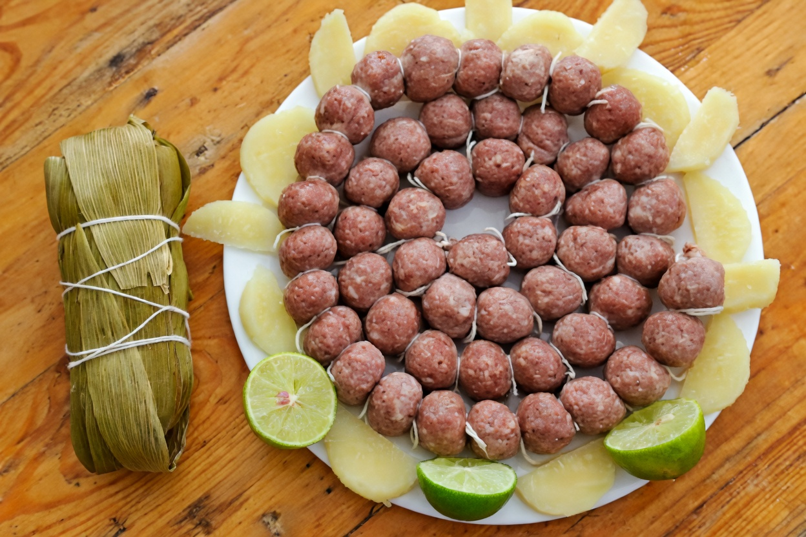

                
Capital mundial de la butifarraFestival en noviembre

            

            

                
<i class="fas fa-calendar-alt"></i>

                <h3>Fiestas Principales</h3>
                <ul>
                    <li><strong>Fiestas Patronales San Antonio de Padua</strong> (10-15 junio, día central 13 junio): alboradas, procesiones, misas solemnes y eventos folclóricos.</li>
                    <li><strong>Festival de la Butifarra</strong> (noviembre): cultura, emprendimiento y arte.</li>
                </ul>
                
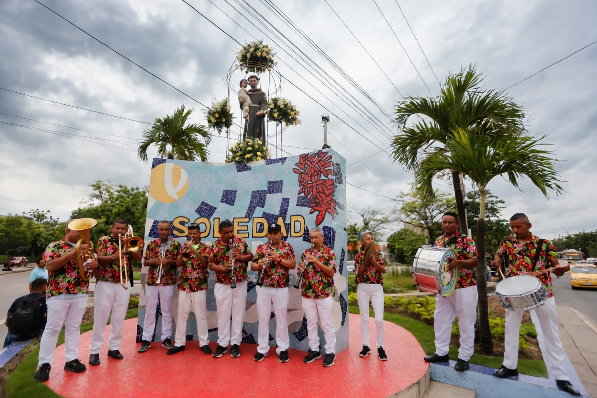

            

        

        

            

                
CUNA DE ARTISTAS

                <h2 class="section-title">Personajes <em>representativos</em></h2>
            

            

                

                    
                    
<i class="fas fa-guitar"></i>

                    <h3>Pacho Galán</h3>
                    
Cantante, compositor, director de orquesta. Creador del merecumbé, autor de "El Sanjuanero", ícono del folclor costeño.

                

                

                    
                    
<i class="fas fa-piano"></i>

                    <h3>Alcibíades Acosta</h3>
                    
Pianista, compositor y bolerista, una de las voces más emblemáticas de la música romántica colombiana.

                

                

                    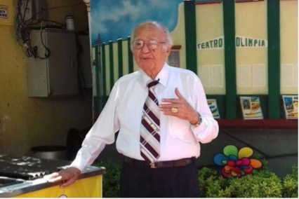
                    
<i class="fas fa-music"></i>

                    <h3>Rafael Campo Miranda</h3>
                    
Compositor de música costeña, autor de "La Cumbia Cienaguera" y decenas de himnos del folclor colombiano.

                

                

                    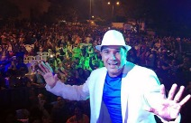
                    
<i class="fas fa-drum"></i>

                    <h3>Checo Acosta</h3>
                    
Cantante de música tropical y folclórica, embajador de la cultura costeña con más de 30 años de trayectoria.

                

                

                    
                    
<i class="fas fa-hand-sparkles"></i>

                    <h3>Efrain Mejía Donado</h3>
                    
Reconocido músico, compositor e investigador folclórico, experto en tradiciones del Caribe colombiano. Gestor cultural que ha llevado el folclor soledeño a escenarios nacionales, preservando el merecumbé y las músicas ancestrales.

                

            

        

    

</section>

<!-- Carnaval -->
<section id="carnaval" class="section">
    

        

            
FIESTA Y ALEGRÍA

            <h2 class="section-title">Carnaval de <em>Soledad</em></h2>
        

        

            

                
<i class="fas fa-mask"></i>

                <h3>El carnaval más auténtico</h3>
                
Se celebra anualmente desde el sábado hasta el martes antes del Miércoles de Ceniza (febrero-marzo). Comienza el segundo sábado de enero con verbenas populares. Es la fiesta folclórica y cultural más importante del municipio.

                
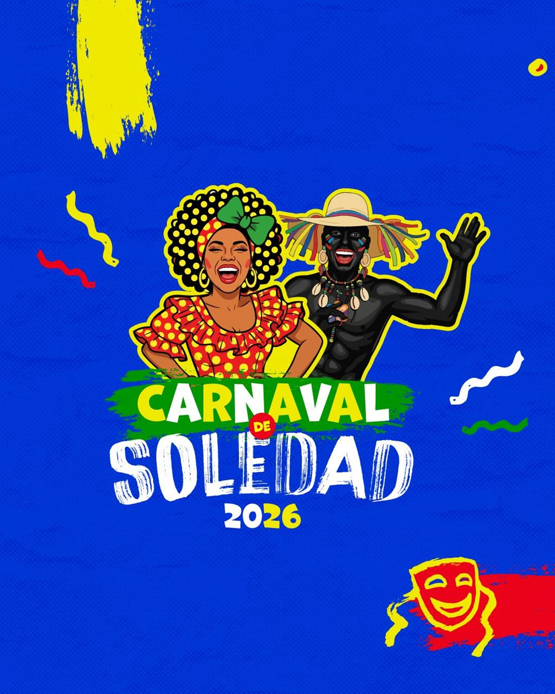

            

            

                
<i class="fas fa-crown"></i>

                <h3>Reina del Carnaval y Lectura del Bando</h3>
                
La Reina del carnaval es designada anualmente y mediante la Lectura del Bando (mediados de enero) promulga la única "ley": bailar y gozar. Barrios eligen sus reinas y participan en el Reinado Reina de Reinas.

                

            

        

    

</section>

<!-- La Décima Soledeña -->
<section id="decima" class="section">
    

        

            
PATRIMONIO ORAL

            <h2 class="section-title">La Décima <em>Soledeña</em></h2>
        

        

            
<i class="fas fa-microphone-alt"></i>

            <h3>Patrimonio Cultural e Inmaterial del Atlántico</h3>
            
La décima soledeña es una expresión poética oral y musical, declarada Patrimonio Cultural e Inmaterial del Atlántico. Consiste en estrofas de diez versos octosílabos con rima consonante, utilizadas para narrar historias, costumbres y la identidad del municipio de Soledad. Transmitida de generación en generación, es un símbolo de la memoria viva del Caribe colombiano.

            

            

            
Versos octosílabosRima consonanteTradición oralPatrimonio del Atlántico

        

    

</section>

<!-- Parque Muvdi -->
<section id="entretenimiento" class="section">
    

        

            
DIVERSIÓN Y FAMILIA

            <h2 class="section-title">Parque <em>Muvdi</em></h2>
        

        

            
<i class="fas fa-tree"></i> <i class="fas fa-swimmer"></i>

            <h3>Parque Muvdi: un espacio multifacético</h3>
            
Es un espacio que combina áreas deportivas, acuáticas y de ocio. Los visitantes destacan su ambiente renovado y la variedad de actividades que permiten pasar un día entero sin salir del recinto. Ideal para disfrutar en familia, con zonas de piscinas, canchas, juegos infantiles y áreas verdes.

            

                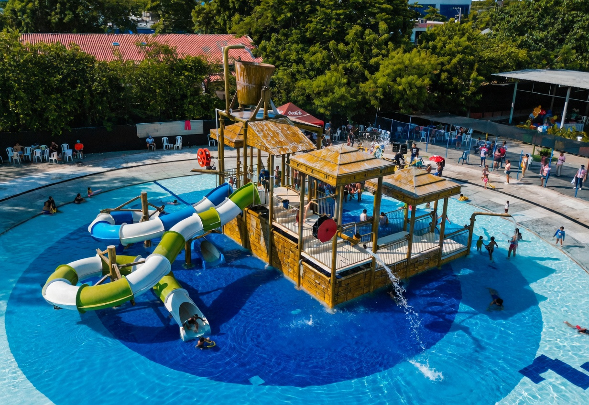
            

            
Zona de piscinasCanchas deportivasÁrea de picnicEntretenimiento familiar

        

    

</section>

<!-- Otros personajes ilustres -->
<section id="personajes" class="section">
    

        

            
MEMORIA Y ORGULLO

            <h2 class="section-title">Otros <em>hijos ilustres</em></h2>
        

        

            

                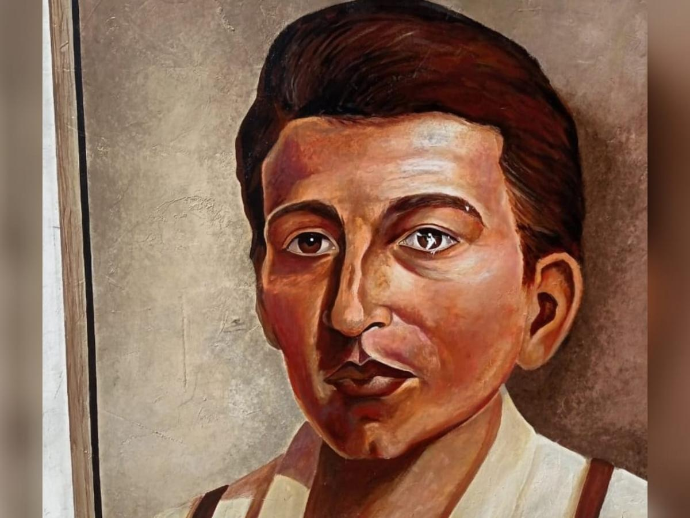
                
<i class="fas fa-feather-alt"></i>

                <h3>Gabriel Antonio Escorcia Gravini</h3>
                
Poeta colombiano, autor de la décima "La gran miseria humana". Considerado uno de los mejores poetas de la historia de Soledad. Su obra fue convertida en paseo vallenato por Lisandro Meza.

            

            

                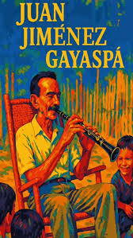
                
<i class="fas fa-trumpet"></i>

                <h3>Juan Jiménez Gayaspá</h3>
                
Gran músico y precursor de la música de viento en Soledad. Su legado vive en matrimonios y fiestas patronales, clave en el folclor del Atlántico.

            

            

                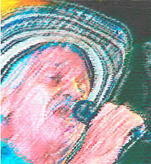
                
<i class="fas fa-microphone-alt"></i>

                <h3>Gabriel Segura Miranda</h3>
                
"El Rey de la Décima". Músico, compositor y decimero de tiempo completo. Sus décimas más conocidas: "Santo y parrandero" y "Con sus fiestas novembrinas".

            

            

                
                
<i class="fas fa-history"></i>

                <h3>Rafael Urbano Lafaurie</h3>
                
Fundador de la Academia de Historia de Soledad, primer corresponsal del municipio. Incidencia social y cultural invaluable.

            

            

                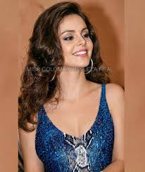
                
<i class="fas fa-futbol"></i>

                <h3>Lizeth Mahecha Arévalo</h3>
                
 Abogada y reina de belleza colombiana que fue ganadora del título Señorita Colombia en 1989.

            

            

                
                
<i class="fas fa-futbol"></i>

                <h3>Henry Zambrano Sandoval</h3>
                
Exfutbolista profesional, referente deportivo.

            

            

                
                
<i class="fas fa-futbol"></i>

                <h3>Ricardo Ciciliano</h3>
                
Futbolista profesional, talento soledeño.

            

            

                
                
<i class="fas fa-tv"></i>

                <h3>Melissa Martínez</h3>
                
Periodista y presentadora, orgullo soledeño.

            

            

                
                
<i class="fas fa-futbol"></i>

                <h3>José Enamorado</h3>
                
Joven promesa del fútbol.

            

            

                
                
<i class="fas fa-futbol"></i>

                <h3>Jordan Barrera</h3>
                
Futbolista profesional en ascenso.

            

        

    

</section>

<!-- Actualidad -->
<section id="actualidad" class="section">
    

        

            
DESARROLLO Y CONECTIVIDAD

            <h2 class="section-title">Transporte, <em>economía e importancia</em></h2>
        

        

            

                
<i class="fas fa-plane"></i> <i class="fas fa-bus"></i>

                <h3>Infraestructura clave</h3>
                <ul>
                    <li>Aeropuerto Internacional Ernesto Cortissoz</li>
                    <li>Terminal de Transportes de Barranquilla (ubicada en Soledad)</li>
                    <li>Sistema masivo Transmetro y corredores viales</li>
                </ul>
                
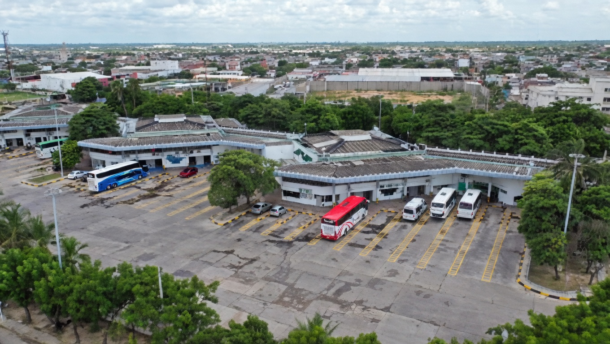

                

                
Estos ejes generan impacto directo en la economía y conectividad metropolitana.

            

            

                
<i class="fas fa-chart-line"></i>

                <h3>Centros comerciales y comercio</h3>
                
Soledad alberga importantes centros comerciales como Nuestro Atlántico, Carnaval y Gran Plaza del Sol, puntos de entretenimiento y economía local.

                
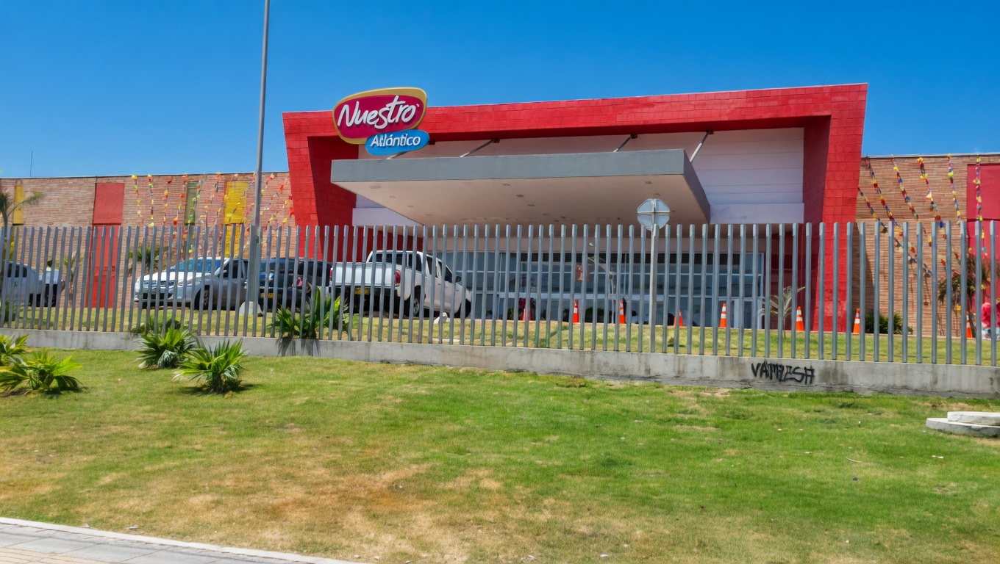

                
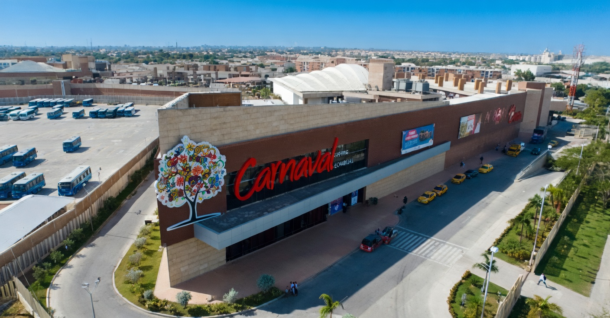

                
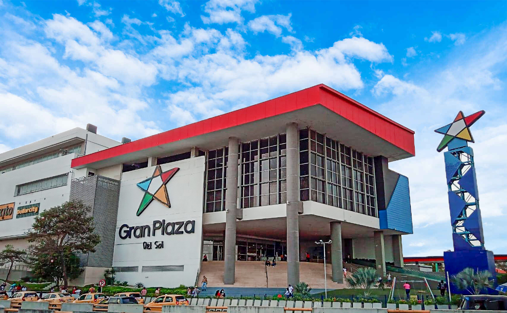

            

        

        

            <h3>Importancia actual</h3>
            
Soledad es uno de los municipios más poblados del Atlántico. Su historia refleja mezcla de culturas, identidad y memoria colectiva. Conocer su pasado fortalece el sentido de pertenencia y educa a las nuevas generaciones para mantener vivas las tradiciones, el orgullo por su legado y el impulso hacia un futuro próspero.

            
Capital de la butifarraCuna del merecumbéPatrimonio bolivarianoCentro metropolitano

        

    

</section>

<!-- Geografía e Hidrología -->
<section id="naturaleza" class="section">
    

        

            
NATURALEZA Y TERRITORIO

            <h2 class="section-title">Hidrología y <em>zona rural</em></h2>
        

        

            

                
<i class="fas fa-water"></i>

                <h3>Río Magdalena y arroyos</h3>
                
El río Magdalena bordea Soledad por el oriente. Arroyos significativos: Don Juan, El Salao, El Platanal, caño Soledad y Ciénaga de la Bahía.

                
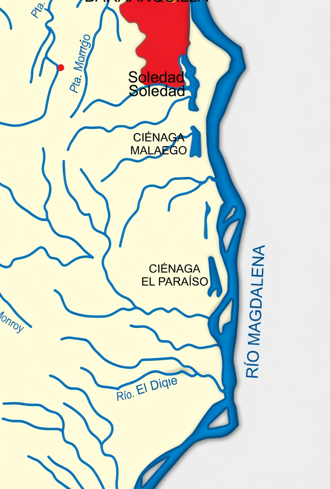

            

            

                
<i class="fas fa-tree"></i>

                <h3>Zona rural</h3>
                
Solo el 2% del territorio es rural. Vereda Isla Cabica en el río Magdalena, además de fincas al suroeste en límites con Galapa y Malambo. Tierras planas y cenagosas cerca al río.

                
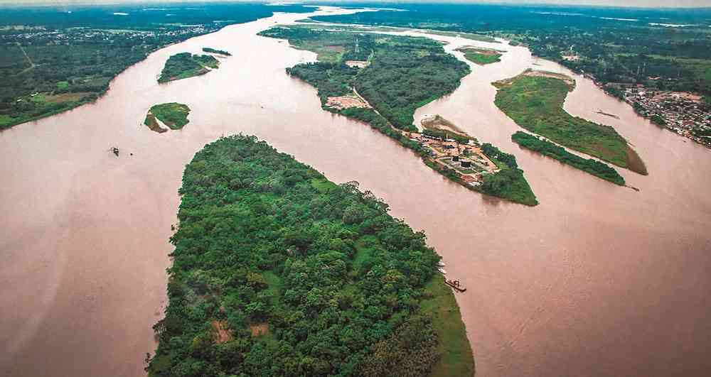

            

        

        

            
<i class="fas fa-map"></i>

            <h3>Localización geográfica</h3>
            
<a class="map-link" href="#" onclick="alert('Soledad en el departamento del Atlántico, área metropolitana de Barranquilla.'); return false;">Ver mapa en el Atlántico</a> | <a class="map-link" href="#" onclick="alert('Soledad en la costa Caribe de Colombia.'); return false;">Ubicación en Colombia</a>

            
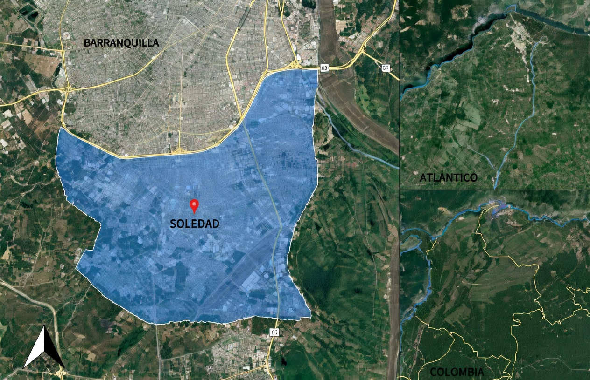

        

    

</section>

<!-- Simón Bolívar -->
<section id="bolivar" class="section">
    

        

            
HUELLAS DEL LIBERTADOR

            <h2 class="section-title">Simón Bolívar en <em>Soledad</em></h2>
        

        

            
<i class="fas fa-landmark"></i>

            <h3>Tres visitas históricas</h3>
            <ul>
                <li><strong>22 de agosto de 1820:</strong> Primera visita, anima tropas para la retoma del Caribe, recibido por el General Mariano Montilla.</li>
                <li><strong>28 de diciembre de 1820:</strong> Acompaña a Antonio Nariño en su postulación como representante; el Consejo Electoral se reúne en la Parroquia San Antonio de Padua.</li>
                <li><strong>4 de octubre de 1830:</strong> Última visita, hospedado en la casa de Pedro Juan Visbal (hoy Casa Museo Bolivariano). Escribe 23 cartas, entre ellas la "última proclama". Permanece hasta el 7 de noviembre, luego parte a Santa Marta donde fallece el 17 de diciembre.</li>
            </ul>
            
Además, en 1860 Soledad fue campo de batalla entre liberales y conservadores.

            
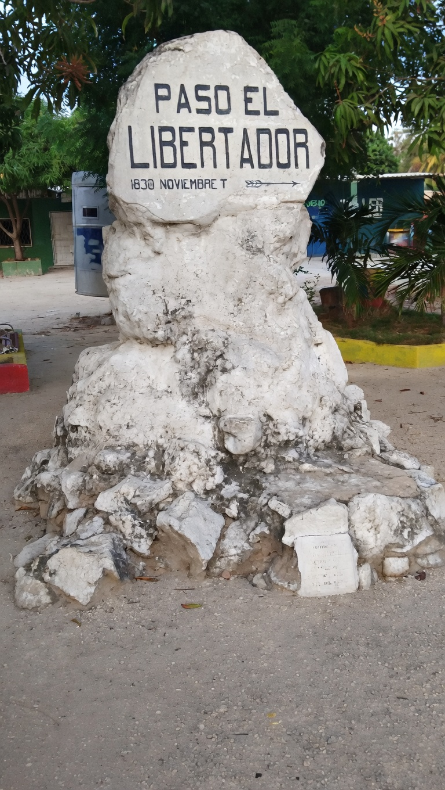

        

    

</section>

<footer>
    
Alcaldía Municipal de Soledad · Secretaría de Cultura y Turismo

    
“Soledad, corazón del Caribe: historia, tradición, poesía, carnaval y libertad”

    
Plaza Mayor de Soledad · Casa Museo Simón Bolívar · Iglesia San Antonio de Padua

    
Secretaría de Cultura: cultura@soledad-atlantico.gov.co · Línea de atención: 605 319 79 38

</footer>

    <i class="fas fa-map-marked-alt"></i>

</body>
</html>
